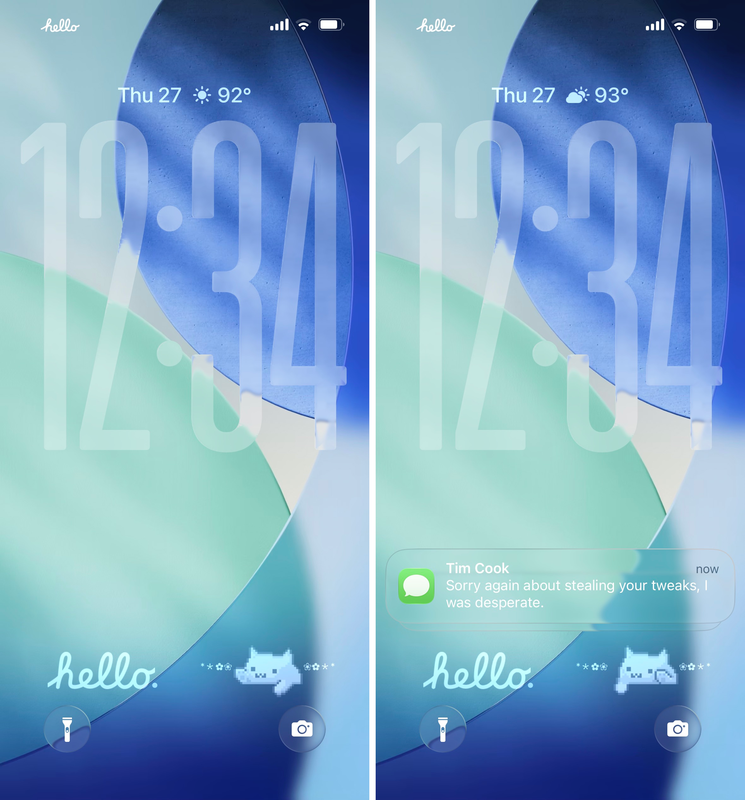
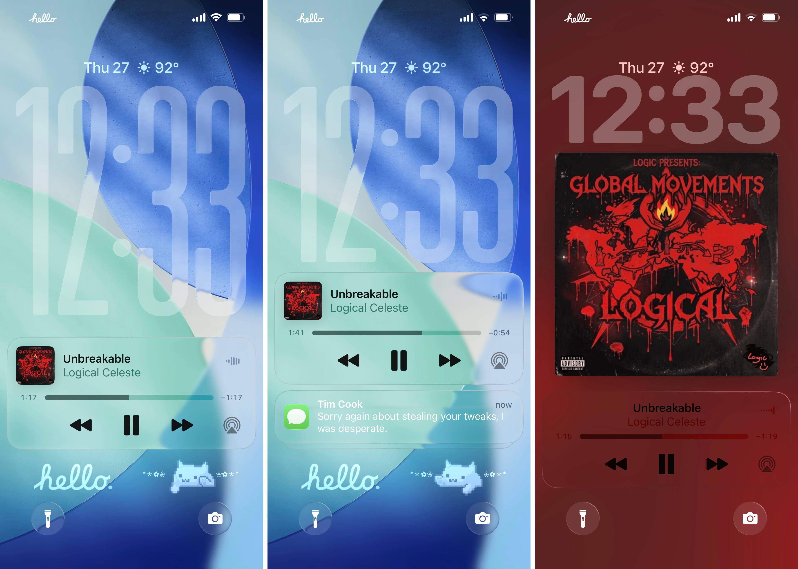

<h1 align="center">Soko</h1>

  
  
  

## About

Soko is an iOS jailbreak tweak that brings the iOS 26-style Lock Screen widget layout to earlier versions of iOS. It moves widgets to the bottom of the Lock Screen, keeps notifications aligned with the new layout, and provides independent offsets for both from Preferences.

## Screenshots

  

  

